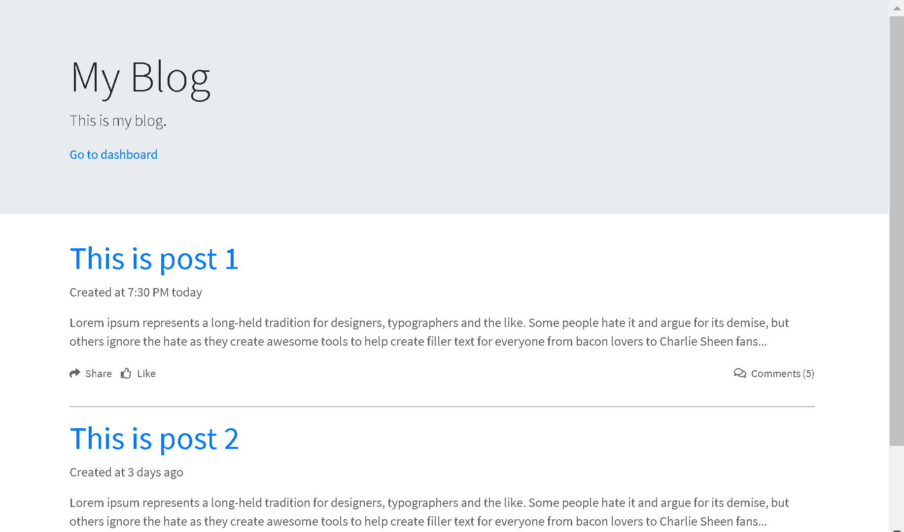

# BlogCore project

A headless CMS builds with clean modern architecture and technology.

[](https://github.com/thangchung/blog-core/blob/master/LICENSE)



# Technical Stack

- .NET SDK (v3.0.100-preview6) & NodeJS
- Blazor v3.0.0-preview6
- IdentityServer 4
- Entity Framework Core
- Protobuf v3.8.0
- Swashbuckle v5.0.0-rc2
- [AdminLTE](https://github.com/ColorlibHQ/AdminLTE) v3.0.0-beta.1

# Run Application

```bash
$ cd src\BlogCore.Hosts.Web.Client\ && npm install && npm run copy && cd ../..
```

At this root folder

```bash
$ dotnet run -p src\BlogCore.Hosts.Web.Server\BlogCore.Hosts.Web.Server.csproj
$ dotnet watch -p src/BlogCore.Hosts.Web.Server/BlogCore.Hosts.Web.Server.csproj run // live reloading
```

Open an another terminal and run

```bash
$ dotnet run -p src\BlogCore.Hosts.IdentityServer\BlogCore.Hosts.IdentityServer.csproj
```

Now, you can access to
- BlogCore Application at http://localhost:5000
- IdentityServer at http://localhost:5001

# Development
## Get code

```bash
git clone git@github.com:thangchung/blog-core.git
cd blog-core
```
Start hacking it!!!

# Copyright and license

Code and documentation copyright 2019 [Thang Chung](https://github.com/thangchung). Code released under the [MIT License](https://github.com/thangchung/blog-core/blob/master/LICENSE).
